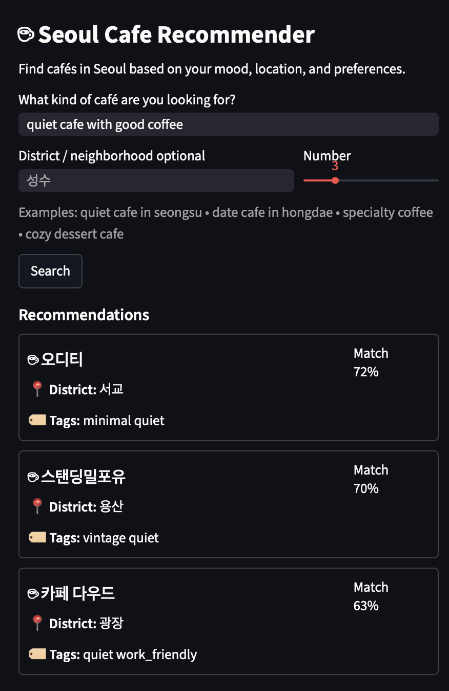
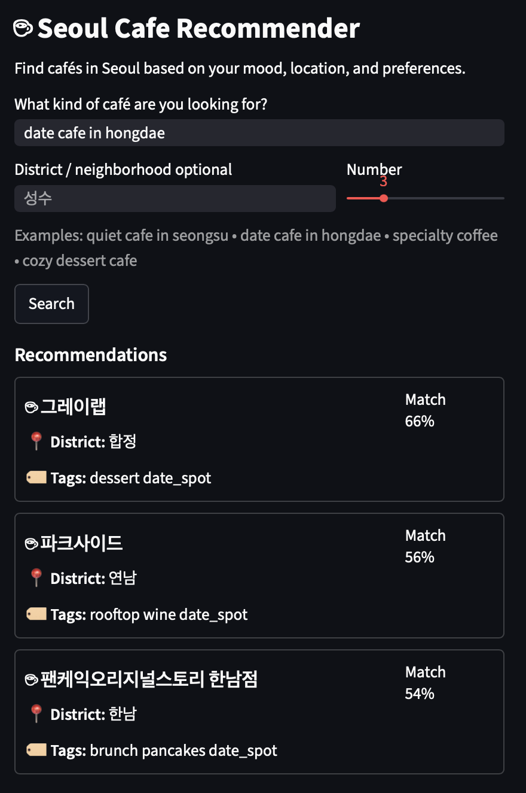

# Seoul Cafe Recommender

AI-powered cafe recommendation system that recommends cafés in Seoul using semantic search and vector similarity.

## Live Demo

https://huggingface.co/spaces/adupuy/seoul-cafe

## Features

- Semantic cafe search using natural language queries
- Neighborhood filtering
- Top-K recommendation retrieval
- Sentence Transformer embeddings
- FAISS vector similarity search
- Interactive Streamlit interface

## Tech Stack

- Python
- Pandas
- Streamlit
- Sentence Transformers
- FAISS

## How It Works

1. The user enters a natural language query.
2. The query is converted into an embedding using a Sentence Transformer model.
3. FAISS retrieves the most similar cafes from the dataset.
4. Matching cafes are displayed with similarity scores.

## Example Queries

- quiet cafe with good coffee
- date cafe in hongdae
- aesthetic dessert cafe
- work-friendly cafe with wifi

## Example Results

### Quiet Cafe Search

### Date Cafe Search

## Future Improvements

- Expand dataset to 200+ cafes
- Open-now filtering
- Price filtering
- Cafe images
- WiFi and power outlet filters